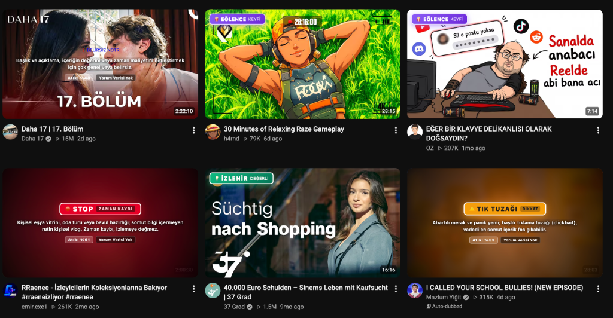
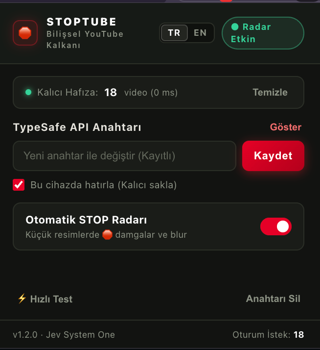

# 🛑 StopTube · Cognitive Shield & Anti-Clickbait Radar for YouTube

> **Defend your prefrontal cortex against watch-time maximization algorithms, empty lifestyle showcases, sensation clickbaits, and disguised sponsor pitches directly on YouTube thumbnails.**
> 
> *YouTube ana sayfası ve önerilerindeki zaman hırsızı videoları bilişsel radardan geçir; tık tuzaklarını, gizli sponsor vitrinlerini ve boş tüketim tuzaklarını doğrudan küçük resim üzerinde teşhis et.*

[](https://developer.chrome.com/docs/extensions/mv3/intro/)
[](https://typesafe.ai)
[](#-test-doğrulaması--automated-tests)
[](#-gizlilik-ve-opsec--privacy--opsec)
[](LICENSE)

---

## 📸 Canlı Önizleme / Visual Showcase

<div align="center">
  <p><b>🛑 YouTube Akışında Bilişsel Damgalar & Akıllı Blur</b></p>
  
  <br><br>
  <p><b>⚡ Minimalist Kontrol, TR/EN Dil Seçimi & 30 Günlük Yerel Hafıza</b></p>
  
</div>

---

## 🌐 İçindekiler / Table of Contents
- [🇹🇷 Türkçe Dokümantasyon](#-türkçe-dokümantasyon)
  - [⚡ Nedir ve Neden Var?](#-nedir-ve-neden-var)
  - [⚖️ Kararda 4 Büyük Etken (Süre, Dislike, Sponsor, Reklam)](#-kararda-4-büyük-etken)
  - [🎯 5 Bilişsel Karar Sınıfı (Verdicts)](#-5-bilişsel-karar-sınıfı)
  - [🚀 Kurulum (Adım Adım)](#-kurulum-adım-adım)
  - [🔒 Gizlilik ve OPSEC](#-gizlilik-ve-opsec)
- [🇬🇧 English Documentation](#-english-documentation)
  - [⚡ What is StopTube?](#-what-is-stoptube)
  - [⚖️ The 4 Key Decisional Drivers](#-the-4-key-decisional-drivers)
  - [🎯 5 Cognitive Verdicts](#-5-cognitive-verdicts)
  - [🚀 Installation Guide](#-installation-guide)
  - [🔒 Privacy & OPSEC](#-privacy--opsec)

---

# 🇹🇷 Türkçe Dokümantasyon

## ⚡ Nedir ve Neden Var?

Modern video platformlarının algoritmaları, izleyicinin **zihinsel gelişimini veya zaman değerini** değil; platformda geçirilen **süreyi (watch time)** ve reklam gösterimlerini maksimize etmek üzere tasarlanmıştır. Bu durum kullanıcıları içi boş "oda turları", "çantamda ne var" tüketim vitrinleri, gizli reklamlar ve abartılı tık tuzakları (clickbait) sarmalına hapseder.

**StopTube**, YouTube ile zihniniz arasına bilişsel bir kalkan yerleştirir. **TypeSafe Jev (System One AI)** motorunu ve deterministik heuristik kuralları kullanarak videoları saniyenin onda biri hızında tartar; videoların üzerine doğrudan avant-garde bilişsel damgalar basar.

---

## ⚖️ Kararda 4 Büyük Etken

StopTube yalnızca başlığa bakmaz; 4 bağımsız ve somut parametreyi eşzamanlı olarak karara dahil eder:

1. **👎 Dislike Oranı (Topluluk Konsensüsü):**
   - Return YouTube Dislike (RYD) API entegrasyonu ile videonun dislike/like oranları anlık çekilir.
   - **%25+ Dislike:** Video başlığı ne olursa olsun doğrudan **🛑 STOP** veya **⚠️ TIK TUZAĞI** seviyesine yükseltilir (Dislike Override).
   - Atık riski otomatik olarak en az **%65 - %95** bandına kilitlenir ve küçük resme `👎 %38 Dislike` uyarısı basılır.

2. **🏷️ Sponsor ve Reklam İçerikleri:**
   - **DOM Dedektörü:** Kart ve izleme sayfasındaki YouTube resmi rozetleri taranır (*"Ücretli tanıtım içerir"* / *"Paid promotion"*).
   - **Deterministik Heuristik Motoru:** Başlık ve açıklamada yer alan `#işbirliği`, `#sponsor`, `ücretli tanıtım`, `indirim kodu`, `promosyon kodu`, `affiliate link`, `linkler aşağıda` kalıpları taranıp skorlanır.
   - **Sponsor Override:** Eğer videoda sponsorluk/reklam tespit edilmişse ve video türü eşya vitrini (`consumer_inventory`) veya yüzeysel tanıtımsa, video doğrudan **🛑 STOP** yapılır, atık riski en az **%75** olarak mühürlenir ve altın sarısı `🏷️ SPONSORLU` rozeti basılır.

3. **⏱️ Süre (Duration & Mid-Roll Reklam Tuzağı):**
   - **8 - 12.5 Dakika Tuzağı (Mid-Roll Ad Padding):** YouTube içerik üreticilerinin videoya birden fazla ara reklam (mid-roll ad) koyabilmek için 2 dakikalık boş bir konuyu yapay olarak 8-10 dakikaya sündürme kalıbı (`480s - 750s`) tespit edilir. Eğer başlıkta tık tuzağı şüphesi varsa atık riski **en az %70**'e yükseltilir.
   - **20+ Dakika Boş Vlog Tuzağı:** 20 dakikayı aşan kişisel vlog, eşya vitrini veya oda turu videolarında atık riski doğrudan **tavan seviyeye (%80+)** fırlatılır.

4. **🧠 TypeSafe Jev System One Soru Matrisi:**
   - `knowledge_density` (İçerik derinliği: `deep`, `moderate`, `low`): Eğitsel ve teknik içerikler (`deep`) atık riski düşükse **✦ İZLENİR · DEĞERLİ** rozetiyle korunur.
   - `is_clickbait` (Noul sürekli olasılık 0.0 - 1.0): %70 üzeri doğrudan tık tuzağı damgası alır.
   - `is_time_waste` (Bilişsel atık olasılığı 0.0 - 1.0).

---

## 🎯 5 Bilişsel Karar Sınıfı

| Karar Damgası (TR / EN) | Renk / Stil | Anlamı ve İçerik Türü | Davranış |
| :--- | :--- | :--- | :--- |
| **🛑 STOP · ZAMAN KAYBI**<br>`STOP · TIME WASTE` | Derin Kırmızı Radyal | Kişisel eşya vitrinleri, bavul/oda turları, somut bilgi içermeyen rutin vloglar ve vakit hırsızı içerikler. | Görseli blurlar, merkezde net teşhis metni ve atık oranı (%) gösterir. |
| **⚠️ TIK TUZAĞI · DİKKAT**<br>`CLICKBAIT · CAUTION` | Kehribar / Turuncu | Abartılı merak yemi, panik dili, başlık ile içerik vaadi uyuşmayan clickbait videolar. | Orta derece blur ve tık tuzağı uyarısı basar. |
| **✦ İZLENİR · DEĞERLİ**<br>`VALUABLE · WORTH IT` | Zümrüt Cam Rozet | Yüksek bilgi yoğunluğuna sahip belgeseller, derin teknik rehberler ve analitik incelemeler. | Görseli bozmaz; sol üstte şık, yarı saydam bir zümrüt rozet yerleştirir. |
| **✦ EĞLENCE · KEYFÎ**<br>`ENTERTAINMENT` | Mor / Ametist Rozet | Kafa dağıtmalık mizah, skeç, oyun veya rahatlatıcı içerikler (bilgi iddiası olmayan). | Görseli bozmaz; sol üstte minimalist mor rozet basar. |
| **✦ BELİRSİZ · NÖTR**<br>`UNCERTAIN` | Duman / Gri Cam Rozet | Başlık veya bağlamdan içerik kalitesi netleştirilemeyen nötr videolar. | Görseli karartmaz; sol üstte zarif duman rozetiyle tarafsız kalır. |

> **👁️ Hover-to-Reveal:** Blurlanmış bir STOP videosunun üzerine fareyle geldiğinizde blur anında sıfırlanır ve YouTube'un hareketli video önizlemesi pürüzsüzce açılır.

---

## 🚀 Kurulum (Adım Adım)

Bu eklenti Chrome Web Store gerektirmeden doğrudan **Geliştirici Modu (Developer Mode)** ile kurulur:

1. Bu depoyu indirin veya klonlayın:
   ```bash
   git clone https://github.com/tufankoc/StopTube.git
   ```
2. Chrome, Brave, Edge veya Arc tarayıcınızda uzantılar sayfasına gidin:
   * **Chrome / Brave:** `chrome://extensions`
   * **Edge:** `edge://extensions`
   * **Arc:** Extensions menüsü
3. Sağ üst köşedeki **Geliştirici Modu (Developer Mode)** anahtarını açın.
4. Sol üstteki **Paketlenmemiş Öğe Yükle (Load Unpacked)** butonuna tıklayın.
5. Klonladığınız `StopTube` klasörünü seçin.
6. Tarayıcı araç çubuğundaki 🛑 simgesine tıklayın, [TypeSafe](https://typesafe.ai) API anahtarınızı girin ve **"Kaydet ve Radarı Başlat"** butonuna basın.
7. **Sıfır Yenileme:** Açık YouTube sekmeleriniz sayfayı yenilemenize gerek kalmadan anında taranmaya ve damgalanmaya başlar!

---

## 🔒 Gizlilik ve OPSEC

* **Sıfır Telemetri:** Hiçbir analiz veya kullanıcı verisi üçüncü taraf sunuculara veya izleyicilere iletilmez.
* **Sıfır Çerez Erişimi:** YouTube hesap bilgileriniz, oturum çerezleriniz veya izleme geçmişiniz asla okunmaz veya saklanmaz.
* **Tamamen Yerel Bellek:** Taranan videolar tarayıcınızın yerel depolama alanında (`chrome.storage.local`) saklanır; aynı video için tekrar API çağrısı yapılmaz.

---

# 🇬🇧 English Documentation

## ⚡ What is StopTube?

Modern recommendation algorithms are engineered to optimize for **watch time** and ad exposure—not your cognitive growth or time sovereignty. This trap pulls viewers into shallow room tours, superficial consumer flexes, hidden sponsored pitches, and sensational clickbaits.

**StopTube** places a cognitive shield between YouTube and your prefrontal cortex. Powered by **TypeSafe Jev (System One AI)** and deterministic heuristic rules, it evaluates video metadata in milliseconds and applies avant-garde visual stamps directly onto thumbnails.

---

## ⚖️ The 4 Key Decisional Drivers

1. **👎 Dislike Ratio (Community Consensus):**
   - Real-time community sentiment retrieved via Return YouTube Dislike (RYD) API.
   - **25%+ Dislike Ratio:** Overrides model verdict directly to **🛑 STOP** or **⚠️ CLICKBAIT** (Dislike Override).
   - Enforces waste risk to **65% - 95%** and places a prominent `👎 XX% Dislike` warning.

2. **🏷️ Sponsored Content & Disguised Ads:**
   - **DOM Badge Detector:** Scans native YouTube badges (*"Paid promotion"*, *"Ücretli tanıtım"*).
   - **Deterministic Heuristics:** Analyzes titles and descriptions for `#ad`, `#sponsored`, discount codes, and affiliate pitches.
   - **Sponsor Override:** Converts lifestyle showcases and routine sponsored hauls directly into **🛑 STOP** with a gold `🏷️ SPONSORED` badge and $\ge 75\%$ waste risk.

3. **⏱️ Duration & Mid-Roll Ad Padding:**
   - **8 - 12.5 Minute Padding Formula:** Detects videos artificially padded to 8–10 minutes solely to inject multiple mid-roll ads. Boosts clickbait waste risk to $\ge 70\%$.
   - **20+ Minute Empty Vlog Trap:** Personal room tours or gear flexing exceeding 20 minutes are locked into maximum waste risk ($\ge 80\%$).

4. **🧠 TypeSafe Jev System One Questions:**
   - `knowledge_density` (`deep`, `moderate`, `low`): Preserves genuine investigative documentaries and engineering tutorials as **✦ VALUABLE · WORTH IT**.
   - `is_clickbait` (Noul continuous probability 0.0 - 1.0).
   - `is_time_waste` (Cognitive time waste probability 0.0 - 1.0).

---

## 🎯 5 Cognitive Verdicts

| Stamp | Visual Style | Definition | Behavior |
| :--- | :--- | :--- | :--- |
| **🛑 STOP · TIME WASTE** | Deep Crimson Radial | Personal room/dorm tours, gear flexing, empty routine vlogs, and disguised promotional hauls. | Blurs thumbnail, overlays bold STOP stamp with diagnosis and waste risk (%). |
| **⚠️ CLICKBAIT · CAUTION** | Amber Glow | Sensational urgency, panic hooks, overhyped titles failing to deliver on substance. | Moderate blur with explicit clickbait warning. |
| **✦ VALUABLE · WORTH IT** | Emerald Glass Pill | Rigorous technical guides, deep documentaries, and analytical research. | Thumbnail remains unblurred; displays an elegant emerald badge. |
| **✦ ENTERTAINMENT** | Amethyst Purple Pill | Casual comedy, sketches, or relaxing gameplay with no educational pretense. | Crisp thumbnail with minimalist purple badge. |
| **✦ UNCERTAIN** | Smoke Gray Pill | Ambiguous context or neutral content. | Neutral badge, thumbnail untouched. |

---

## 🚀 Installation Guide

Install directly in **Developer Mode** (No Chrome Web Store required):

1. Clone or download this repository:
   ```bash
   git clone https://github.com/tufankoc/StopTube.git
   ```
2. In Chrome, Brave, Edge, or Arc, navigate to extensions:
   * **Chrome / Brave:** `chrome://extensions`
   * **Edge:** `edge://extensions`
3. Toggle on **Developer Mode** in the top-right corner.
4. Click **Load Unpacked** in the top-left corner.
5. Select the `StopTube` directory.
6. Click the 🛑 icon in your browser toolbar, enter your [TypeSafe](https://typesafe.ai) API key, and hit **"Save and Start Radar"**.
7. **Zero-Reload Activation:** All active YouTube tabs wake up and scan visible cards immediately without requiring a manual page refresh!

---

## 🔒 Privacy & OPSEC

* **Zero Telemetry:** No analytics, tracking tokens, or user data are sent to external servers.
* **Zero Cookie Access:** StopTube never accesses your YouTube cookies, account information, or personal watch history.
* **Local Caching (0 ms Reflex):** Analyzed videos are cached locally (`chrome.storage.local`) for 30 days using an LRU policy (up to 2,500 videos), minimizing API calls and token consumption.

---

## 🧪 Test Doğrulaması / Automated Tests

The entire suite runs natively via Node.js test runner in ~65ms:

```bash
npm test
```

```
✔ 2-Kademeli Önbellek Akışı (0.72ms)
✔ LRU Önbellek Boyutu: 2500 video (5.11ms)
✔ cleanVideo doğrulamaları (1.56ms)
✔ requestFor: Jev System One soru yapısı (0.88ms)
✔ analysisFor: STOP, VALUABLE, Consensus Override (1.78ms)
✔ evaluate: 401 ve 429 hata yakalama (1.03ms)
✔ computeClickbaitHeuristics: Sansasyonel başlıklar & noktalama tuzakları (0.14ms)
✔ computeSponsorHeuristics: Sponsor ve reklam kalıpları (0.08ms)
✔ parseDurationToSeconds: Süre matematiksel ayrıştırma (0.04ms)
✔ analysisFor: Sponsor Override & Mid-roll padding modifiyeri (0.18ms)
✔ analysisFor: Dislike Override & Return YouTube Dislike (RYD) (0.28ms)
✔ analysisFor (İngilizce Dil Desteği): TR/EN i18n çıktıları (0.18ms)
✔ Manifest V3, Popup DOM ve YouTube URL yönlendirme bütünlüğü (2.11ms)
✔ Sürüm Senkronizasyonu & Chrome Storage API Güvenliği (0.49ms)
✔ Popup Hata Bariyeri & Background Mesaj Yönlendirme (0.24ms)

ℹ tests 35 | pass 35 | fail 0 (66 ms)
```

---

## 📜 Lisans / License

[MIT License](LICENSE) · Built by [Tufan Koç](https://github.com/tufankoc).
Feel free to fork, customize, and build your own cognitive filters!
